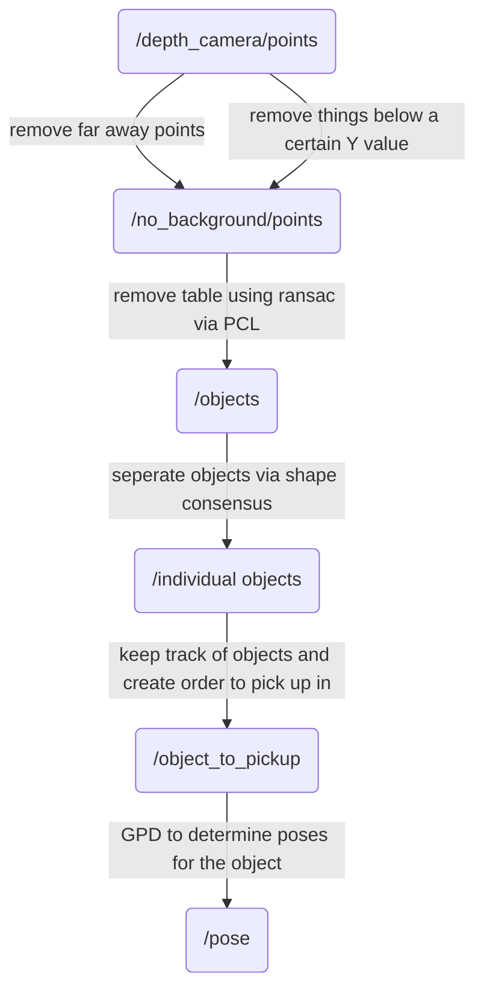

## bag files.


- bag files can be downloaded from the [Intel realsense repo](https://github.com/IntelRealSense/librealsense/blob/master/doc/sample-data.md#files). 
- these can then be run by launching the `depth_image_2_point_cloud.launch` file.

```bash
roslaunch scfms_object_detection depth_image_2_point_cloud.launch bag:="{location of bag file}" 
```




#### dealing with point clouds.

currently it seems like 
- X is left and right of the robot.
- z is in front of the robot 
- y is vertical, positive down
- i.e. camera values